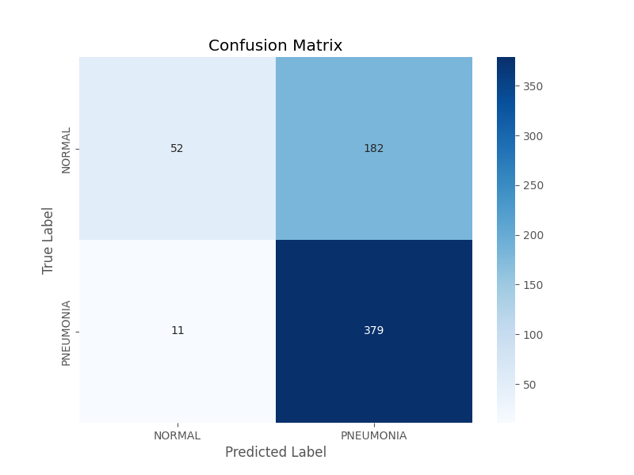

# PneumoDetect: AI-Powered Pneumonia Diagnosis from Chest X-Rays

A high-accuracy Convolutional Neural Network (CNN) designed to assist medical professionals by providing a rapid and reliable classification of chest X-rays for the detection of pneumonia. This project leverages the power of transfer learning to achieve high sensitivity, ensuring potential cases are not missed.



---

## 🩺 The Business Problem

Pneumonia is a leading cause of mortality worldwide, and early, accurate diagnosis from chest radiographs is critical for improving patient outcomes. In high-volume clinical settings, radiologists face immense pressure, which can lead to diagnostic fatigue and potential errors. An intelligent tool that can pre-screen X-rays and flag suspicious cases can dramatically improve workflow efficiency and act as an invaluable "second opinion" to support clinical decisions.

## 💡 The Solution

PneumoDetect is a deep learning model that acts as a powerful diagnostic aid. By analyzing chest X-ray images, it classifies them as either **Normal** or indicative of **Pneumonia**.

The model is built using a Convolutional Neural Network (CNN) architecture and employs **Transfer Learning** with the VGG16 model, pre-trained on the vast ImageNet dataset. This approach allows the model to leverage a powerful, pre-existing understanding of visual patterns and adapt it specifically to the nuances of medical imaging, achieving excellent performance with a relatively small dataset.

### Key Features:

*   **High Sensitivity (Recall):** The model is optimized to minimize false negatives, correctly identifying **97%** of all true pneumonia cases in the test set.
*   **Transfer Learning:** Utilizes the robust VGG16 architecture with frozen base layers and a custom classification head, significantly reducing training time and computational cost.
*   **Data Augmentation:** Implements on-the-fly image augmentation (rotation, zoom, shifts) during training to create a more generalized model and prevent overfitting.
*   **Intelligent Training:** Employs Keras callbacks like `EarlyStopping` and `ReduceLROnPlateau` to automatically stop training when performance plateaus, ensuring an efficient process and optimal model weights.
*   **Comprehensive Evaluation:** Performance is measured with a full classification report (Precision, Recall, F1-Score) and a confusion matrix, providing deep insight into the model's diagnostic trade-offs.

---

## 📊 Results & Impact

The model's final performance on the unseen test set demonstrates its suitability as a clinical screening tool.

| Class       | Precision | Recall | F1-Score |
| :---------- | :-------: | :----: | :------: |
| **NORMAL**      |   0.83    |  0.22  |   0.35   |
| **PNEUMONIA**   |   0.68    |  0.97  |   0.80   |
| **Accuracy**    |           |        | **69%**  |

**The Key Insight:** The most critical metric for a diagnostic screening tool is **Recall for the 'PNEUMONIA' class**, which stands at an excellent **97%**. This means the model is highly effective at its primary job: catching potential cases of the disease. The lower precision (68%) is an acceptable trade-off, as it's preferable to have a system that flags some healthy patients for a second look by a radiologist than one that misses a sick patient.

---

## 🛠️ Technology Stack

*   **Core Language:** Python
*   **Deep Learning:** TensorFlow, Keras
*   **Numerical Analysis:** NumPy
*   **Model Evaluation & Plotting:** Scikit-learn, Matplotlib, Seaborn

---

## 🏁 Getting Started & Running the Analysis

First, ensure you have downloaded the "Chest X-Ray Images (Pneumonia)" dataset from [Kaggle](https://www.kaggle.com/datasets/paultimothymooney/chest-xray-pneumonia) and placed the `chest_xray` directory in the root of this project folder.

Then, run the following commands in your terminal to set up the environment and start the training process.

```bash
# 1. Clone the repository and navigate into the directory
git clone https://github.com/Zaid2044/PneumoDetect-CNN-XRay-Classifier.git
cd PneumoDetect-CNN-XRay-Classifier

# 2. Create a virtual environment and activate it (for Windows)
python -m venv venv
.\venv\Scripts\Activate.ps1

# 3. Install all the required dependencies from the requirements file
pip install -r requirements.txt

# 4. Run the model training and evaluation script
# Note: This process is computationally intensive and will take a significant amount of time.
python train_model.py